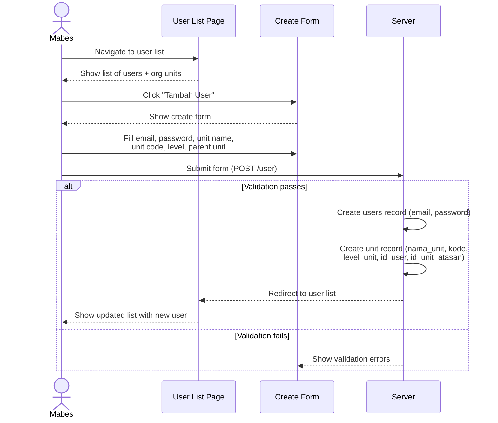
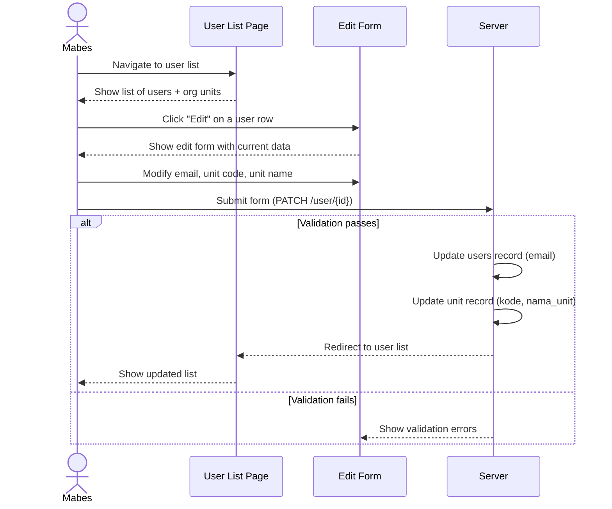
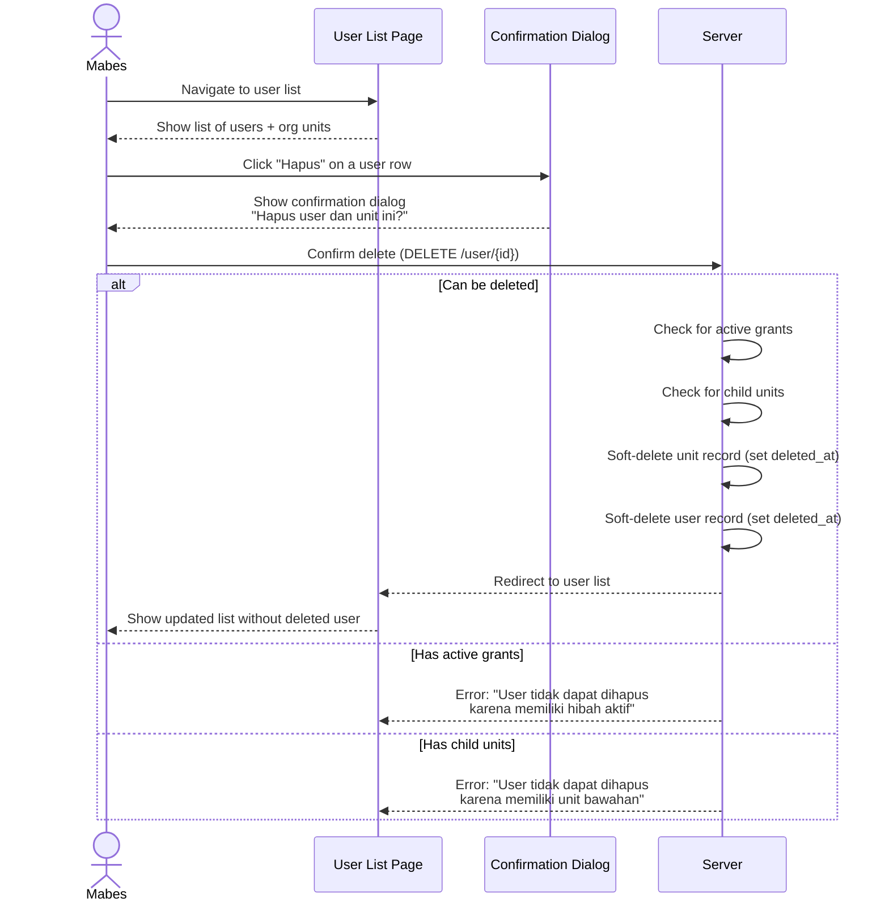
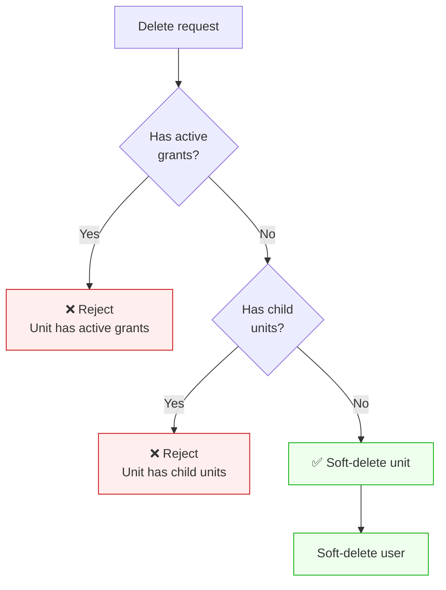

# Feature: User Management

## Overview

Mabes (headquarters) provisions and manages user accounts along with their organizational units. There is no self-registration — all user accounts are created exclusively by Mabes. Each user account is tied 1:1 to an organizational unit (OrgUnit).

## Business Rules

- Only Mabes can access user management pages (list, create, edit, delete)
- Non-Mabes users are redirected to the dashboard when attempting to access user management
- Creating a user also creates an associated organizational unit (OrgUnit) record
- Updating a user can also update their organizational unit data
- Each user maps to exactly one organizational unit via `unit.id_user`
- Deleting a user soft-deletes both the user and their org unit
- A unit cannot be deleted if it has active (non-soft-deleted) grants or child units

## Actors

| Actor  | Permissions                                        |
|--------|----------------------------------------------------|
| Mabes  | Create, read, update, delete user accounts + units |
| Others | No access (redirected to dashboard)                |

## Routes

| Method | Path            | Name         | Description         | Auth  | Role  |
|--------|-----------------|--------------|---------------------|-------|-------|
| GET    | /user           | user.index   | List all users      | Yes   | Mabes |
| GET    | /user/create    | user.create  | Show create form    | Yes   | Mabes |
| POST   | /user           | user.store   | Create user + unit  | Yes   | Mabes |
| GET    | /user/{id}/edit | user.edit    | Show edit form      | Yes   | Mabes |
| PATCH  | /user/{id}      | user.update  | Update user + unit  | Yes   | Mabes |
| DELETE | /user/{id}      | user.destroy | Soft-delete user + unit | Yes | Mabes |

---

## User Journey: Create Org Unit

Mabes creates a new user account with an associated organizational unit.

### Create Form Fields

| Field                 | Type     | Rules                              | Description               |
|-----------------------|----------|------------------------------------|---------------------------|
| email                 | email    | required, string, unique           | User login email          |
| password              | password | required, confirmed, min:8         | User password             |
| password_confirmation | password | required                           | Password confirmation     |
| nama_unit             | string   | required                           | Organizational unit name  |
| kode                  | string   | required                           | Unit code                 |
| level_unit            | enum     | required, in:satuan_kerja,satuan_induk,mabes | Unit level     |
| id_unit_atasan        | integer  | required, exists:unit,id_user      | Parent unit (via id_user) |

### Data Created
- `users` record: name (= nama_unit), email, hashed password
- `unit` record: nama_unit, kode, level_unit, id_user (FK to users.id), id_unit_atasan

### Validation Rules
- Email must be unique across all users
- Password must be confirmed (password = password_confirmation)
- Parent unit must exist (valid `id_user` in unit table)
- Level must be a valid enum value

---

## User Journey: Update Org Unit

Mabes updates an existing user account and/or its organizational unit data.

### Update Form Fields

| Field     | Type   | Rules                                | Description              |
|-----------|--------|--------------------------------------|--------------------------|
| email     | email  | required, unique (except current)    | Updated email            |
| kode      | string | required                             | Updated unit code        |
| nama_unit | string | required                             | Updated unit name        |

### Data Updated
- `users` record: email
- `unit` record: kode, nama_unit

---

## User Journey: Delete Org Unit

Mabes soft-deletes a user account and its associated organizational unit.

### Deletion Policy

OrgUnit is business/master data — uses **soft delete**.

### Pre-Delete Validation

| Check                          | Condition                                        | Error Message                                           |
|--------------------------------|--------------------------------------------------|---------------------------------------------------------|
| No active grants               | `unit.grants()->exists()` must be false          | User tidak dapat dihapus karena memiliki hibah aktif    |
| No child units                 | `unit.children()->exists()` must be false        | User tidak dapat dihapus karena memiliki unit bawahan   |

### What Happens on Soft Delete
- `unit.deleted_at` is set (OrgUnit uses `SoftDeletes`)
- Associated user account is also soft-deleted
- Existing FK references (assessment results, status history) remain intact via `nullOnDelete` / soft delete
- `kepala_unit` records are **not** cascade-deleted (they belong to the unit's history)

### What Does NOT Happen
- Hard delete of any records
- Cascade deletion of grants, chiefs, or assessment results
- Modification of child units' `id_unit_atasan` (must be reassigned first)

---

## Test Scenarios

### Happy Path — Create
1. Mabes can access the user list page
2. Mabes can access the create user form
3. Mabes creates a user with email, password, unit name, code, level, and parent unit — records created in both `users` and `unit` tables
4. After creating a user, redirected to user list

### Happy Path — Update
5. Mabes can access the edit user form
6. Mabes updates user email and unit code — both tables updated, old data replaced
7. After updating a user, redirected to user list

### Happy Path — Delete
8. Mabes soft-deletes a user with no grants or child units — both user and unit get `deleted_at` set
9. After deleting, redirected to user list
10. Deleted user no longer appears in user list
11. Deleted user can no longer log in

### Validation — Create
1. Create fails with duplicate email
2. Create fails with mismatched password confirmation
3. Create fails with missing required fields (email, password, nama_unit, kode, level_unit, id_unit_atasan)
4. Create fails with invalid parent unit reference
5. Create fails with invalid level_unit value

### Validation — Update
6. Update fails with duplicate email (belonging to another user)
7. Update fails with missing required fields

### Validation — Delete
8. Delete rejected when unit has active grants — error message shown
9. Delete rejected when unit has child units — error message shown

### Access Control
1. Non-Mabes user accessing user list → redirected to dashboard
2. Non-Mabes user accessing create user form → redirected to dashboard
3. Non-Mabes user accessing edit user form → redirected to dashboard
4. Non-Mabes user attempting delete → redirected to dashboard
