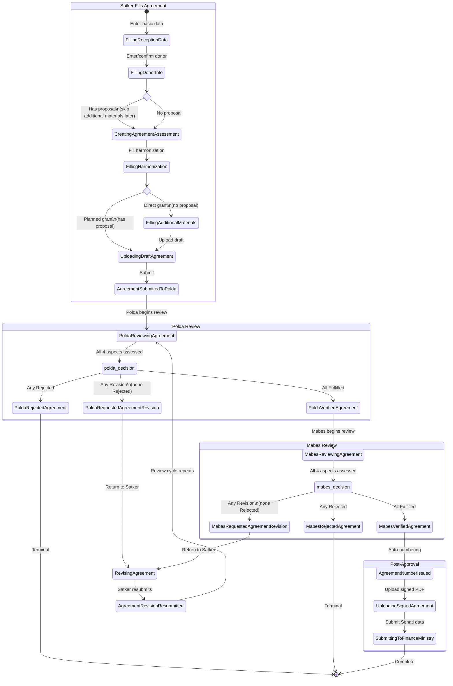
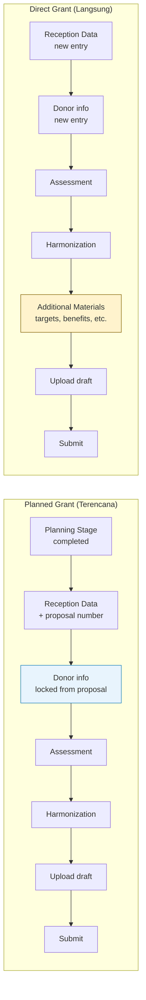
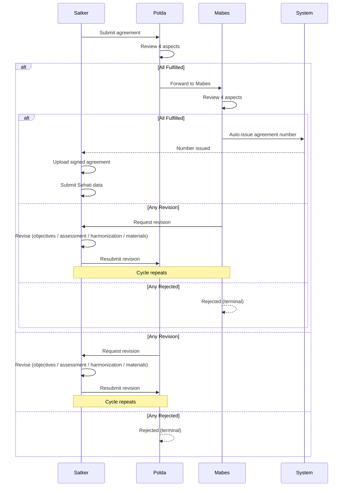

# Journey: Grant Agreement Lifecycle

## Overview

The agreement journey covers the full lifecycle of formalizing a grant agreement (perjanjian), from Satker entering basic reception data through multi-level review to Mabes issuing an official agreement number. This journey applies to both grant types:
- **Planned grants** (`GrantType::Planned`) — enter Agreement after Planning is completed
- **Direct grants** (`GrantType::Direct`) — start directly at Agreement, skipping Planning

## Actors

| Actor  | Role                                                  |
|--------|-------------------------------------------------------|
| Satker | Creates, fills, submits, and revises the agreement    |
| Polda  | First-level review (4-aspect assessment)              |
| Mabes  | Final review (4-aspect assessment), auto-numbering    |

## Status Flow Diagram

## Planned vs Direct Grant Paths

## Steps

| Step | Actor  | Action                              | Status After                              | Condition         |
|------|--------|-------------------------------------|-------------------------------------------|-------------------|
| 1    | Satker | Fill basic reception data           | `FillingReceptionData`                    | Always            |
| 2    | Satker | Enter/confirm donor info            | `FillingDonorInfo`                        | Always            |
| 3    | Satker | Create assessment document          | `CreatingAgreementAssessment`             | Always            |
| 4    | Satker | Fill harmonization data             | `FillingHarmonization`                    | Always            |
| 5    | Satker | Fill additional materials           | `FillingAdditionalMaterials`              | Direct grants only|
| 6    | Satker | Upload draft agreement              | `UploadingDraftAgreement`                 | Always            |
| 7    | Satker | Submit to Polda                     | `AgreementSubmittedToPolda`               | Always            |
| 8    | Polda  | Begin review                        | `PoldaReviewingAgreement`                 | Always            |
| 9    | Polda  | Assess all 4 aspects                | `PoldaVerified/Rejected/RequestedRevision`| Always            |
| 10   | Mabes  | Begin review                        | `MabesReviewingAgreement`                 | Always            |
| 11   | Mabes  | Assess all 4 aspects                | `MabesVerified/Rejected/RequestedRevision`| Always            |
| 12   | System | Issue agreement number              | `AgreementNumberIssued`                   | Always            |

## Step 1: Fill Basic Reception Data

Satker enters the basic grant reception information to start the agreement.

### Business Rules
- Creates a `Grant` record with `GrantType::Direct`, `GrantStage::Agreement`
- Required fields: grant name (`nama_hibah`), donor letter number (`nomor_surat_dari_pemberi_hibah`), objectives (`tujuan`)
- Objectives are stored as `GrantInformation` + `GrantInformationContent` records (chapter: `ProposalChapter::Objective`)
- Status transitions to `GrantStatus::FillingReceptionData`

### Proposal Inheritance (Planned Grants)
When starting from an existing proposal:
- Satker provides the `nomor_usulan` (proposal number) to link the agreement to an approved proposal
- System can verify the proposal number exists via API endpoint
- If valid, the following 7 sections are **automatically copied** from Planning to Agreement stage:
  1. Purpose (`ProposalChapter::Purpose`)
  2. Objective (`ProposalChapter::Objective`)
  3. Target (`ProposalChapter::Target`)
  4. Benefit (`ProposalChapter::Benefit`)
  5. Implementation Plan (`ProposalChapter::ImplementationPlan`)
  6. Reporting Plan (`ProposalChapter::ReportingPlan`)
  7. Evaluation Plan (`ProposalChapter::EvaluationPlan`)
- Copied records are created with `tahapan = GrantStage::Agreement`

## Step 2: Enter/Confirm Donor Info

Satker provides or confirms donor (pemberi hibah) information.

### Business Rules
- Same donor entry as Planning: create new or select existing donor
- Status transitions to `GrantStatus::FillingDonorInfo`
- **If grant has proposal**: donor data is loaded from proposal and **cannot be changed** — submitted changes are ignored
- **If grant has no proposal**: after entering donor, a Purpose section (`ProposalChapter::Purpose`) is auto-generated

## Step 3: Create Assessment Document

Satker creates a self-assessment covering 4 mandatory aspects. Identical structure to Planning assessment.

### Business Rules
- Creates 4 `GrantAssessment` records (Technical, Economic, Political, Strategic)
- Each assessment has 2 `GrantAssessmentContent` paragraphs matching the aspect's prompts
- Status transitions to `GrantStatus::CreatingAgreementAssessment`

## Step 4: Fill Harmonization Data

Satker enters harmonization data including grant form, budget, withdrawal plan, and supervision mechanism.

### Form Fields

| Field                            | Type              | Description                           |
|----------------------------------|-------------------|---------------------------------------|
| bentuk_hibah                     | GrantForm enum[]  | Grant form(s): Money, Goods, Services |
| mata_uang                        | string            | Currency code (e.g., "USD", "IDR")    |
| rencana_kebutuhan_anggaran       | array             | Budget plan line items                |
| rencana_penarikan_hibah          | array             | Withdrawal plan items                 |
| mekanisme_pengawasan_hibah       | array             | Supervision mechanism paragraphs      |

### Budget Plan Item Fields
| Field       | Type    | Description  |
|-------------|---------|--------------|
| nomor_urut  | integer | Line number  |
| uraian      | string  | Description  |
| nilai       | integer | Amount       |

### Withdrawal Plan Item Fields
| Field       | Type    | Description    |
|-------------|---------|----------------|
| nomor_urut  | integer | Line number    |
| uraian      | string  | Description    |
| tanggal     | date    | Scheduled date |
| nilai       | integer | Amount         |

### Business Rules
- Budget items stored in `GrantBudgetPlan` records
- Withdrawal plan stored in `GrantWithdrawalPlan` records
- Supervision mechanism stored as `GrantInformation` (`ProposalChapter::SupervisionMechanism`) with `GrantInformationContent`
- **Total grant value is auto-calculated**: `nilai_hibah = SUM(budget_item.nilai)`
- Status transitions to `GrantStatus::FillingHarmonization`

## Step 5: Fill Additional Materials (Direct Grants Only)

For grants with no proposal (`ada_usulan = false`), Satker fills in supplementary sections.

### Sections

| Section                    | Enum Case            | Content Type      |
|----------------------------|----------------------|-------------------|
| Target (Sasaran)           | `Target`             | 1+ paragraphs    |
| Benefit (Manfaat)          | `Benefit`            | 1+ paragraphs    |
| Implementation Plan        | `ImplementationPlan` | 1+ paragraphs    |
| Activity Timeline          | —                    | Schedule records  |
| Reporting Plan             | `ReportingPlan`      | 1+ paragraphs    |
| Evaluation Plan            | `EvaluationPlan`     | 1+ paragraphs    |

### Business Rules
- Each section creates `GrantInformation` + `GrantInformationContent` records
- Activity timeline stored in `ActivitySchedule` records
- Satker may also add custom additional chapters (`bab_tambahan`) with arbitrary titles
- Status transitions to `GrantStatus::FillingAdditionalMaterials`
- **Skipped for planned grants** — these sections are already copied from the proposal

## Step 6: Upload Draft Agreement

Satker uploads the draft agreement document (PDF).

### Business Rules
- File uploaded as attachment(s) with type `NASKAH_PERJANJIAN`
- Uses polymorphic file storage (attachable to `Grant`)
- Status transitions to `GrantStatus::UploadingDraftAgreement`

## Step 7: Submit to Polda

Satker submits the completed agreement for Polda review.

### Business Rules
- Status transitions to `GrantStatus::AgreementSubmittedToPolda`
- No additional data required — all previous steps must be completed

## Step 8–9: Polda Review

Polda reviews the agreement by assessing all 4 mandatory aspects. Same logic as Planning review.

### Business Rules
- Polda begins review: status transitions from `AgreementSubmittedToPolda` to `PoldaReviewingAgreement`
- Each aspect receives `Fulfilled`, `Revision`, or `Rejected` result
- Results stored in `GrantAssessmentResult` with Polda `id_unit`

### Decision Logic (after all 4 aspects assessed)

| Condition                               | Outcome                                     |
|-----------------------------------------|---------------------------------------------|
| All 4 aspects `Fulfilled`               | `PoldaVerifiedAgreement` (→ Mabes)          |
| Any aspect `Rejected`                   | `PoldaRejectedAgreement` (terminal)         |
| Any `Revision`, none `Rejected`         | `PoldaRequestedAgreementRevision` (→ Satker)|

## Step 10–11: Mabes Review

Mabes reviews the agreement after Polda verification. Same assessment logic.

### Business Rules
- Mabes begins review: status transitions from `PoldaVerifiedAgreement` to `MabesReviewingAgreement`
- Same per-aspect assessment and decision logic as Polda
- Results stored in `GrantAssessmentResult` with Mabes `id_unit`

### Decision Logic (after all 4 aspects assessed)

| Condition                               | Outcome                                       |
|-----------------------------------------|-----------------------------------------------|
| All 4 aspects `Fulfilled`               | `MabesVerifiedAgreement` (→ numbering)        |
| Any aspect `Rejected`                   | `MabesRejectedAgreement` (terminal)           |
| Any `Revision`, none `Rejected`         | `MabesRequestedAgreementRevision` (→ Satker)  |

## Step 12: Agreement Number Issued

When Mabes verifies, the system automatically issues an official agreement number.

### Business Rules
- `GrantNumbering` record created with `tahapan = GrantStage::Agreement`
- Status transitions: `MabesVerifiedAgreement` → `AgreementNumberIssued`
- Automatic — no user action required

## Post-Approval (After Number Issued)

After the agreement number is issued, two additional steps are available:

| Step | Status                        | Description                          |
|------|-------------------------------|--------------------------------------|
| 1    | `UploadingSignedAgreement`    | Satker uploads signed agreement PDF  |
| 2    | `SubmittingToFinanceMinistry` | Satker enters Sehati data for Kemenkeu |

## Revision Cycle

When Polda or Mabes requests revision, the agreement returns to Satker.

### What Satker Can Revise
1. **Reception data objectives** — update the `tujuan` section only
2. **Assessment aspects** — revise assessment paragraph content
3. **Harmonization data** — revise budget, withdrawal plan, supervision mechanism (except grant allocation if proposal exists)
4. **Additional materials** — revise supplementary sections (direct grants only)

### Business Rules
- Each revision creates status history with `GrantStatus::RevisingAgreement`
- After revising, Satker resubmits: status transitions to `AgreementRevisionResubmitted`
- The review cycle repeats until all aspects are fulfilled or the agreement is rejected

---

## Test Scenarios

### Happy Path — Step 1: Basic Reception Data
1. Satker fills basic reception data (name, donor letter number, objectives) — creates grant record with `FillingReceptionData`
2. System verifies existing proposal number via API — returns proposal data (name, purpose, objectives)
3. Starting from proposal copies 7 sections from Planning to Agreement stage
4. Copied records use `GrantStage::Agreement` as tahapan

### Happy Path — Step 2: Donor Info
5. Satker enters new donor info — creates donor, links to grant, status `FillingDonorInfo`
6. If grant has proposal, donor data is locked (submitted changes are ignored)
7. If grant has no proposal, Purpose section is auto-generated after donor entry

### Happy Path — Step 3: Assessment
8. Satker creates 4-aspect assessment — 4 assessment records, 8 content records, status `CreatingAgreementAssessment`

### Happy Path — Step 4: Harmonization
9. Satker fills harmonization (grant form, currency, budget, withdrawal plan, supervision) — status `FillingHarmonization`
10. Grant value auto-calculated from budget items (e.g., 2 items of 1,000,000 = 2,000,000)

### Happy Path — Step 5: Additional Materials (Direct Only)
11. Satker fills additional materials (targets, benefits, schedule, reporting, evaluation) — status `FillingAdditionalMaterials`
12. Satker adds custom additional chapters with arbitrary titles

### Happy Path — Step 6–7: Upload and Submit
13. Satker uploads draft agreement PDF — status `UploadingDraftAgreement`
14. Satker submits agreement to Polda — status `AgreementSubmittedToPolda`

### Happy Path — Review Cycle
15. Polda begins review — status `PoldaReviewingAgreement`
16. Polda fulfills an aspect — creates assessment result with `Fulfilled`
17. Polda rejects an aspect — creates assessment result with `Rejected` and reason
18. Polda requests revision — creates assessment result with `Revision` and reason
19. All 4 Polda aspects fulfilled → `PoldaVerifiedAgreement`
20. Mabes begins review — status `MabesReviewingAgreement`
21. All 4 Mabes aspects fulfilled → `MabesVerifiedAgreement`, then auto `AgreementNumberIssued`
22. Agreement number record created with `GrantStage::Agreement`

### Decision Logic
1. Polda: all 4 aspects fulfilled → `PoldaVerifiedAgreement`
2. Polda: any aspect rejected → `PoldaRejectedAgreement`
3. Polda: any revision + no rejections → `PoldaRequestedAgreementRevision`
4. Mabes: all 4 aspects fulfilled → `MabesVerifiedAgreement`
5. Mabes: any aspect rejected → `MabesRejectedAgreement`
6. Mabes: any revision + no rejections → `MabesRequestedAgreementRevision`

### Revision Cycle
1. Satker revises reception data objectives
2. Satker revises assessment aspects
3. Satker revises harmonization data (except grant allocation if proposal exists)
4. Satker revises additional materials (direct grants only)
5. Satker resubmits revised agreement

### Navigation
1. After reception data → redirected to donor info form
2. After donor info → redirected to assessment form
3. After assessment → redirected to harmonization form
4. After harmonization (direct grants only) → redirected to additional materials form
5. After additional materials → redirected to draft upload form

### Conditional Logic
1. Additional materials step is skipped for planned grants (ada_usulan = true)
2. Donor data is read-only when grant has a proposal
3. Purpose section auto-generated for direct grants after donor entry
