# Journey: Grant Planning Lifecycle

## Overview

The planning journey covers the full lifecycle of a grant proposal (usulan), from Satker initializing the proposal through multi-level review to Mabes issuing an official planning number. This journey applies to Direct grants with proposals (`GrantType::Direct` + `ada_usulan = true`), which must complete Planning before moving to Agreement. Note: `GrantType::Planned` (TERENCANA/HDR) is a separate category — not this flow.

## Actors

| Actor  | Role                                              |
|--------|---------------------------------------------------|
| Satker | Creates, fills, submits, and revises the proposal |
| Polda  | First-level review (4-aspect assessment)          |
| Mabes  | Final review (4-aspect assessment), auto-numbering|

## Status Flow Diagram

## Review Decision Logic

```mermaid
flowchart TD
    A[Reviewer assesses<br/>4 mandatory aspects] --> B{All 4<br/>assessed?}
    B -- No --> A
    B -- Yes --> C{Any aspect<br/>Rejected?}
    C -- Yes --> D[❌ Rejected<br/>Terminal]
    C -- No --> E{Any aspect<br/>Revision?}
    E -- Yes --> F[🔄 Revision Requested<br/>Return to Satker]
    E -- No --> G[✅ Verified<br/>Forward to next level]

    style D fill:#fee,stroke:#c00
    style F fill:#ffefd5,stroke:#f90
    style G fill:#efe,stroke:#0a0
```

## Steps

| Step | Actor  | Action                        | Status After                              |
|------|--------|-------------------------------|-------------------------------------------|
| 1    | Satker | Initialize — enter grant name | `PlanningInitialized`                     |
| 2    | Satker | Enter donor info              | `FillingDonorCandidate`                   |
| 3    | Satker | Fill proposal document        | `CreatingProposalDocument`                |
| 4    | Satker | Create assessment document    | `CreatingPlanningAssessment`              |
| 5    | Satker | Submit to Polda               | `PlanningSubmittedToPolda`                |
| 6    | Polda  | Begin review                  | `PoldaReviewingPlanning`                  |
| 7    | Polda  | Assess all 4 aspects          | `PoldaVerified/Rejected/RequestedRevision`|
| 8    | Mabes  | Begin review                  | `MabesReviewingPlanning`                  |
| 9    | Mabes  | Assess all 4 aspects          | `MabesVerified/Rejected/RequestedRevision`|
| 10   | System | Issue planning number         | `PlanningNumberIssued`                    |

## Step 1: Initialize Proposal

Satker enters a grant activity name to create the initial grant record.

### Business Rules
- Creates a `Grant` record with `GrantType::Direct`, `GrantStage::Planning`, `ada_usulan = true`
- The grant is owned by the Satker (`id_satuan_kerja = user.id`)
- Status history is created with `GrantStatus::PlanningInitialized`
- Satker can edit the activity name before submission

### Data Created
- `hibah` record (grant name, type, stage, owning Satker)
- `riwayat_perubahan_status_hibah` entry

## Step 2: Enter Donor Info

Satker provides donor (pemberi hibah) information.

### Business Rules
- Satker can create a new donor or select an existing one
- If an existing donor is selected, the grant links to that donor record
- If a new donor is provided, a `pemberi_hibah` record is created first
- Status transitions to `GrantStatus::FillingDonorCandidate`

### Data Created
- `pemberi_hibah` record (if new donor)
- `hibah.id_pemberi_hibah` updated

## Step 3: Fill Proposal Document

Satker fills in the proposal document, organized into 10 chapters with budget items and activity timeline.

### Chapters (via `ProposalChapter` enum)

| # | Chapter                | Enum Case            | Content Type               |
|---|------------------------|----------------------|----------------------------|
| 1 | General (Umum)         | `General`            | 3 paragraphs (background)  |
| 2 | Purpose (Maksud)       | `Purpose`            | Auto-generated paragraph   |
| 3 | Objective (Tujuan)     | `Objective`          | Selectable objectives      |
| 4 | Target (Sasaran)       | `Target`             | 1+ paragraphs              |
| 5 | Benefit (Manfaat)      | `Benefit`            | 2 paragraphs               |
| 6 | Implementation Plan    | `ImplementationPlan` | 1+ paragraphs              |
| 7 | Budget Plan (RAB)      | `BudgetPlan`         | Line items (uraian + nilai)|
| 8 | Reporting Plan         | `ReportingPlan`      | 1+ paragraphs              |
| 9 | Evaluation Plan        | `EvaluationPlan`     | 1+ paragraphs              |
| 10| Closing (Penutup)      | `Closing`            | 1 paragraph                |

### Business Rules
- Each chapter creates a `GrantInformation` record with associated `GrantInformationContent` paragraphs
- Budget items are stored in `GrantBudgetPlan` records
- Activity timeline items are stored in `ActivitySchedule` records
- Currency is specified (e.g., "IDR")
- **Total grant value is auto-calculated**: `nilai_hibah = SUM(budget_item.nilai)`
- Status transitions to `GrantStatus::CreatingProposalDocument`

### Budget Item Fields
| Field       | Type    | Description             |
|-------------|---------|-------------------------|
| nomor_urut  | integer | Line number             |
| uraian      | string  | Description             |
| nilai       | integer | Amount in currency unit |

### Activity Timeline Fields
| Field            | Type   | Description  |
|------------------|--------|--------------|
| keterangan       | string | Description  |
| tanggal_mulai    | date   | Start date   |
| tanggal_selesai  | date   | End date     |

## Step 4: Create Assessment Document

Satker creates a self-assessment covering 4 mandatory aspects.

### Assessment Aspects (via `AssessmentAspect` enum)

| Aspect    | Enum Case   | Required Paragraphs |
|-----------|-------------|---------------------|
| Technical | `Technical` | 2 (per prompts)     |
| Economic  | `Economic`  | 2 (per prompts)     |
| Political | `Political` | 2 (per prompts)     |
| Strategic | `Strategic` | 2 (per prompts)     |

### Business Rules
- Creates 4 `GrantAssessment` records (one per mandatory aspect)
- Each assessment has 2 `GrantAssessmentContent` paragraphs matching the aspect's prompts
- Satker may add optional custom aspects (e.g., "Lainnya") with custom paragraphs
- Status transitions to `GrantStatus::CreatingPlanningAssessment`

## Step 5: Submit to Polda

Satker submits the completed proposal for Polda review.

### Business Rules
- Status transitions to `GrantStatus::PlanningSubmittedToPolda`
- No additional data is required — all steps must be completed beforehand

## Step 6–7: Polda Review

Polda reviews the proposal by assessing all 4 mandatory aspects.

### Business Rules
- Polda begins review: status transitions from `PlanningSubmittedToPolda` to `PoldaReviewingPlanning`
- Each aspect receives one of three results (via `AssessmentResult` enum):
  - `Fulfilled` — aspect meets requirements
  - `Revision` — aspect needs changes (requires `keterangan` note)
  - `Rejected` — aspect fails requirements (requires `keterangan` note)
- Results are stored in `GrantAssessmentResult` records linked to `id_unit` (reviewer)

### Decision Logic (after all 4 aspects assessed)

| Condition                               | Outcome                                |
|-----------------------------------------|----------------------------------------|
| All 4 aspects `Fulfilled`               | `PoldaVerifiedPlanning` (→ Mabes)      |
| Any aspect `Rejected`                   | `PoldaRejectedPlanning` (terminal)     |
| Any `Revision`, none `Rejected`         | `PoldaRequestedPlanningRevision` (→ Satker) |

## Step 8–9: Mabes Review

Mabes reviews the proposal after Polda verification. Same assessment logic as Polda.

### Business Rules
- Mabes begins review: status transitions from `PoldaVerifiedPlanning` to `MabesReviewingPlanning`
- Same per-aspect assessment and decision logic as Polda review
- Results stored in `GrantAssessmentResult` with Mabes `id_unit`

### Decision Logic (after all 4 aspects assessed)

| Condition                               | Outcome                                  |
|-----------------------------------------|------------------------------------------|
| All 4 aspects `Fulfilled`               | `MabesVerifiedPlanning` (→ numbering)    |
| Any aspect `Rejected`                   | `MabesRejectedPlanning` (terminal)       |
| Any `Revision`, none `Rejected`         | `MabesRequestedPlanningRevision` (→ Satker) |

## Step 10: Planning Number Issued

When Mabes verifies, the system automatically issues an official planning number.

### Business Rules
- `GrantNumbering` record created with `tahapan = GrantStage::Planning`
- Status transitions: `MabesVerifiedPlanning` → `PlanningNumberIssued`
- This is automatic — no user action required

## Revision Cycle

When Polda or Mabes requests revision, the proposal returns to Satker.

### What Satker Can Revise
1. **Grant name** — PATCH to update `hibah.nama_hibah`
2. **Donor info** — Update existing donor data or replace with a different donor
3. **Proposal chapters** — Re-submit all chapter content (full replacement)
4. **Assessment aspects** — Update mandatory aspect paragraphs or modify custom aspects (add/remove/edit paragraphs)

### Business Rules
- Each revision action creates a status history entry with `GrantStatus::RevisingPlanning`
- The `status_sebelum` (previous status) is loaded from the most recent status history entry
- Revision notes include description of changes (e.g., "unit merevisi nama kegiatan dari X menjadi Y")
- After revising, Satker can resubmit: status transitions to `PlanningRevisionResubmitted`
- The review cycle repeats until all aspects are fulfilled or the proposal is rejected

---

## Test Scenarios

### Happy Path
1. Satker initializes proposal with activity name — creates grant record with `PlanningInitialized` status
2. Satker enters new donor info — creates donor record, links to grant, status `FillingDonorCandidate`
3. Satker uses existing donor — links existing donor to grant
4. Satker fills proposal document with all 10 chapters — creates information records, budget items, timeline
5. Grant value is auto-calculated from budget items (e.g., 2 items of 1,000,000 = 2,000,000)
6. Satker creates assessment with 4 mandatory aspects (2 paragraphs each) — creates 4 assessments, 8 content records
7. Satker adds optional custom aspect — creates 5th assessment with custom paragraphs
8. Satker submits proposal to Polda — status `PlanningSubmittedToPolda`
9. Polda begins review — status `PoldaReviewingPlanning`
10. Polda fulfills an aspect — creates assessment result with `Fulfilled`
11. Polda rejects an aspect — creates assessment result with `Rejected` and reason
12. Polda requests revision for an aspect — creates assessment result with `Revision` and reason
13. All 4 Polda aspects fulfilled — status auto-transitions to `PoldaVerifiedPlanning`
14. Mabes begins review — status `MabesReviewingPlanning`
15. Mabes fulfills an aspect — creates assessment result with `Fulfilled`
16. Mabes rejects an aspect — creates assessment result with `Rejected` and reason
17. Mabes requests revision — creates assessment result with `Revision` and reason
18. All 4 Mabes aspects fulfilled — status `MabesVerifiedPlanning`, then auto `PlanningNumberIssued`
19. Planning number record created with `GrantStage::Planning`

### Decision Logic
1. Polda: all 4 aspects fulfilled → `PoldaVerifiedPlanning`
2. Polda: any aspect rejected (even with fulfilled) → `PoldaRejectedPlanning`
3. Polda: any revision + no rejections → `PoldaRequestedPlanningRevision`
4. Mabes: all 4 aspects fulfilled → `MabesVerifiedPlanning`
5. Mabes: any aspect rejected → `MabesRejectedPlanning`
6. Mabes: any revision + no rejections → `MabesRequestedPlanningRevision`

### Revision Cycle
1. Satker revises grant name — updates `hibah.nama_hibah`, status `RevisingPlanning`
2. Satker revises donor by updating existing donor data — updates `pemberi_hibah` fields
3. Satker revises donor by replacing with different donor — updates `hibah.id_pemberi_hibah`
4. Satker revises proposal chapters — replaces all chapter content
5. Satker revises mandatory assessment aspect — replaces paragraph content
6. Satker revises custom assessment aspect by editing paragraphs
7. Satker revises custom assessment aspect by removing paragraphs
8. Satker revises custom assessment aspect by adding paragraphs
9. Satker resubmits revised proposal — status `PlanningRevisionResubmitted`
10. Revision status_sebelum correctly reflects most recent status history entry

### Navigation
1. After entering grant name → redirected to donor info form
2. After entering donor → redirected to proposal document form
3. After entering proposal → redirected to assessment form
